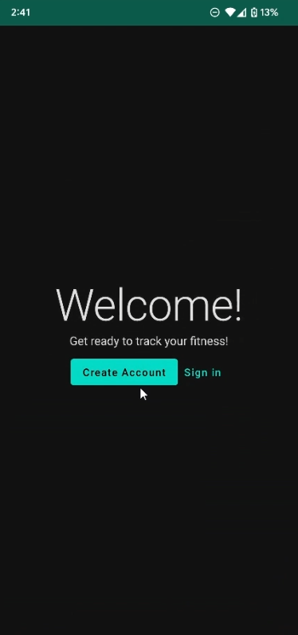
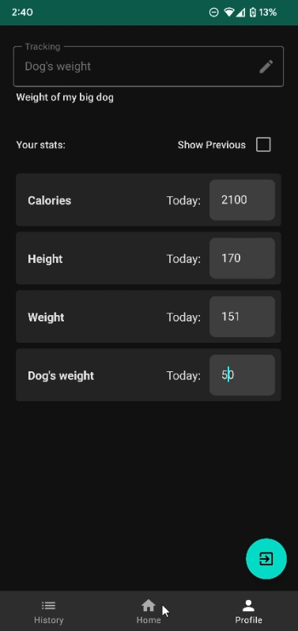
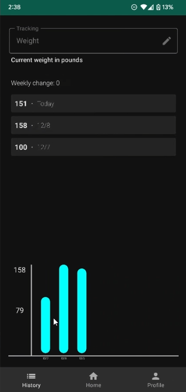
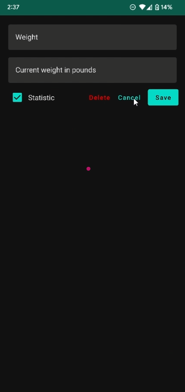

# FitnessTrackingApp
Android app for tracking and storing flexible Fitness progress. 
* Easily add and edit any amount of trackable items (such as exercises, body stats, or anything countable).
* Trackables can be quickly switched between at the top of any page.
* Supports user login to maintain exercise log in the cloud.
* View and manage a trackable's entire history.

## Sign in Page (Authentication)
Create an account or Sign in to access your tracking progress.

## Quick Logging (Main tracking home page)

Quickly add counts to the day's count of the selected exercise (or tracking value).

Also allows hovering quickly over the device to add 1.

To change the count for the daily, simply click on the large value to edit it.

## Statistics Tracking (Profile)
Keep track of changing values for each day with the profile tab.

Stat values can be easily added or deleted like normal tracking items.

## History 
View and manage the past days' history for each trackable activity and view progress on a graph. 

## Edit a trackable activity
Set the name, description, and whether or not it should be treated as a statistic (like weight, daily calories)

